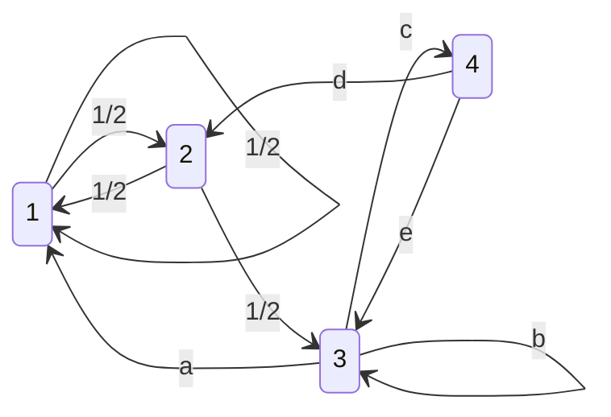

# Ejercicio 1: Cadenas de Markov

<Enunciado titulo="Ejercicio 1.">

El movimiento anual entre 4 ciudades está regido por el siguiente diagrama de
transición. Se sabe que $v = (0, 0, \frac{1}{2}, \frac{1}{2})^t$ es un estado de equilibrio.

**(a)** Hallar la matriz de transición **P**.

**(b)** Determinar la distribución de población después de 10 años,
si la distribución inicial es $v_0 = (\frac{1}{2}, 0, \frac{1}{2}, 0)^t$.

**(c)** ¿Existe $P^\infty$? Si existe, calcularla.

**(d)** Implemente `estado_limite(P, v0, max_iter, tol)` en Python, que busca el estado
límite de la distribución inicial `v0`. En caso de no hallarlo con tolerancia `tol`,
o de realizar más de `max_iter` iteraciones, la función debe retornar `None`
con el mensaje correspondiente.

</Enunciado>


---

## Interpretación del Enunciado

El sistema modela el movimiento anual de población entre 4 ciudades. El diagrama de transición del enunciado es:



La matriz de transición $P$ asociada es:

$$
P = \begin{pmatrix}
1/2 & 1/2 & a & 0 \\
1/2 & 0 & 0 & d \\
0 & 1/2 & b & e \\
0 & 0 & c & 0
\end{pmatrix}

$$
```

Las probabilidades $a, b, c, d, e$ son incógnitas que se determinan imponiendo:

- Cada columna de $P$ suma 1 (distribución de probabilidad válida).
- El vector $v = (0,\, 0,\, \frac{1}{2},\, \frac{1}{2})^t$ es estado de equilibrio, es decir, $Pv = v$.


---

## Solución del Ejercicio

### Inciso A — Matriz de Transición P

> **(a)** Hallar la matriz de transición **P**.

{/* Leer el diagrama de transición y construir P columna a columna (columna j = distribución
     de probabilidad de salir desde la ciudad j). Verificar que cada columna sume 1. */}

### Inciso B — Distribución después de 10 años

> **(b)** Determinar la distribución de población después de 10 años,
> si la distribución inicial es $v_0 = (\frac{1}{2}, 0, \frac{1}{2}, 0)^t$.

{/* Calcular v_10 = P^10 * v_0. Usar la descomposición espectral si P es diagonalizable. */}

### Inciso C — Existencia de $P^\infty$

> **(c)** ¿Existe $P^\infty$? Si existe, calcularla.

{/* Analizar autovalores de P. Si todos excepto λ=1 tienen |λ| < 1, la potencia converge. */}

### Inciso D — Implementación Python

> **(d)** Implemente `estado_limite(P, v0, max_iter, tol)` en Python.

Ver implementación en [`verificacion.py`](verificacion.py).

{/* --8<-- "Examen_2026_02_25/01_cadenas_markov/verificacion.py" */}
