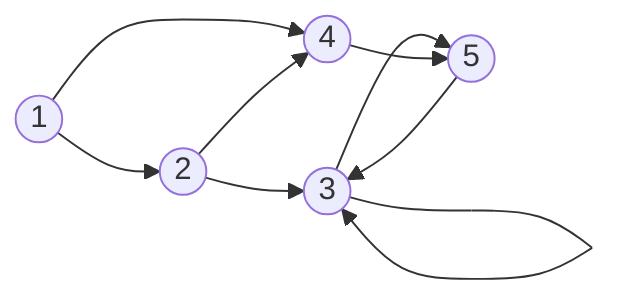

# Ejercicio 2: Cadenas de Markov

> **Ejercicio 2.**
> 
> a) Sea $P \in \mathbb{R}^{n \times n}$ la matriz de un proceso de Markov en el que hay $k$ estados $i_1, i_2, \ldots, i_k$ tales que la probabilidad de pasar de $i_j$ a $i_{j+1}$ para $j = 1, \ldots, k-1$ y de $i_k$ a $i_1$ es 1. Probar que existe un $\lambda \in \mathbb{C}$ autovalor de $P$ tal que $\lambda \neq 1$, pero $|\lambda| = 1$.
> 
> b) Considerar el proceso descripto por el grafo, donde las probabilidades de transición desde cada nodo se reparten en partes iguales entre todas las ramas salientes. Hallar un estado de equilibrio. ¿Es único? ¿Se alcanza este equilibrio desde cualquier estado inicial?

## Interpretación del Enunciado

El problema evalúa las propiedades espectrales subyacentes de las matrices estocásticas (Procesos de Markov). En el inciso (a), se nos pide una demostración general acerca de los autovalores en cadenas de Markov que presentan **estados cíclicos determinísticos** cerrados. En el inciso (b), se debe construir la matriz de transición a partir del grafo dado, calcular su estado de equilibrio (autovector asociado a $\lambda=1$) y analizar su convergencia basándonos en la conectividad del grafo.

### Representación del Grafo

A continuación, visualizamos el flujo de estados descrito en el inciso (b):

---

## Solución del Inciso (a)

Se describe un subconjunto de $k$ estados que se transicionan de manera determinística conformando un ciclo cerrado sin absorción ni escape. Al renombrar y ordenar temporalmente esta sub-cadena $i_1, i_2, \ldots, i_k$ para que abarquen los primeros $k$ índices, la matriz estocástica $P$ asume una estructura de bloque donde las transiciones a lo largo de estos estados se concentran en una submatriz de permutación cíclica $C_{k \times k}$:

$$
C = \begin{pmatrix}
0 & 0 & \cdots & 0 & 1 \\
1 & 0 & \cdots & 0 & 0 \\
0 & 1 & \cdots & 0 & 0 \\
\vdots & \vdots & \ddots & \vdots & \vdots \\
0 & 0 & \cdots & 1 & 0
\end{pmatrix}
$$

Y nuestra matriz global $P$ toma la forma:

$$
P = \begin{pmatrix}
C & \ast \\
0 & \ast
\end{pmatrix}
$$

Los autovalores de una matriz triangular/bloque-triangular son la unión de los autovalores de sus bloques diagonales. De este modo, los autovalores de la submatriz cíclica $C$ son también autovalores de $P$.

Nos preguntamos, ¿cuáles son los autovalores de una permutación puramente cíclica de longitud $k$?
Por su geometría rotacional, al aplicarle el proceso $k$ veces volvimos al estado original. Esto significa algebraicamente que $C^k = I$ (la matriz identidad $k \times k$).

Aplicando propiedades de autovalores, si $v$ es autovector de $C$ con autovalor $\lambda$, entonces:

$$
C^k v = \lambda^k v \implies I v = \lambda^k v \implies \lambda^k = 1
$$

Por ende, los autovalores de $C$ son las **raíces $k$-ésimas de la unidad**:

$$
\lambda_m = e^{i\frac{2\pi m}{k}}, \quad m = 0, 1, \ldots, k-1
$$

Para cualquier valor de $m > 0$ y menor a $k$, obtenemos un autovalor perteneciente al plano complejo $\mathbb{C}$ tal que $\lambda \neq 1$. Sin embargo, su módulo sigue siendo unitario:

$$
|\lambda_m| = |e^{i\frac{2\pi m}{k}}| = 1
$$

Queda entonces probado que el espectro de cualquier cadena de Markov con ciclos determinísticos siempre aloja autovalores diferentes de 1 que residen justo en la frontera del disco unidad complejo.

---

## Solución del Inciso (b)

Armamos la matriz estocástica por columnas $P$ a base de que todas las aristas que parten de un nodo dividen sus probabilidades equitativamente.
Notamos las transiciones de salida para cada nodo $j$:
- De $1 \to \{2, 4\}$ (2 salidas $\implies p=0.5$ c/u)
- De $2 \to \{3, 4\}$ (2 salidas $\implies p=0.5$ c/u)
- De $3 \to \{3, 5\}$ (2 salidas $\implies p=0.5$ c/u)
- De $4 \to \{5\}$ (1 salida $\implies p=1.0$)
- De $5 \to \{3\}$ (1 salida $\implies p=1.0$)

Ubicando las probabilidades de ir de la columna $j$ a la fila $i$, obtenemos nuestra $P \in \mathbb{R}^{5 \times 5}$:

$$
P = \begin{pmatrix}
0 & 0 & 0 & 0 & 0 \\
0.5 & 0 & 0 & 0 & 0 \\
0 & 0.5 & 0.5 & 0 & 1 \\
0.5 & 0.5 & 0 & 0 & 0 \\
0 & 0 & 0.5 & 1 & 0
\end{pmatrix}
$$

**Estado de equilibrio y unicidad:**
Un estado de equilibrio $v_{eq}$ satisface $P v_{eq} = v_{eq}$, es decir, es un autovector asociado a $\lambda=1$. Por definición matricial será único si el autovalor $\lambda=1$ tiene multiplicidad algebraica 1, lo cual ocurre generalmente en componentes fuertemente conexas que absorban la cadena.

Observando el grafo y la matriz, los estados **1, 2 y 4 son transitorios**. Tarde o temprano la cadena de azar escapa y cae hacia la componente inferior conformada por **3 y 5**.

Un subgrafo $\{3, 5\}$ forma una **clase recurrente cerrada**, la cual interactúa absorbiendo toda la probabilidad con estas probabilidades reducidas:
- 3 va a 3 (0.5), y va a 5 (0.5)
- 5 va a 3 (1.0), y va a 5 (0)

Al existir una única clase absorbente o fondo recurrente, existe un **único estado de equilibrio** final (el autovalor $\lambda=1$ tendrá multiplicidad 1). Todos los estados transitorios tenderán hacia una masa de cero en el equilibrio infinito.

Para hallarlo, resolvemos $(P - I) v_{eq} = 0$:

$$
\begin{cases}
-v_1 = 0 \implies v_1 = 0 \\
0.5 v_1 - v_2 = 0 \implies v_2 = 0 \\
0.5 v_2 - 0.5 v_3 + v_5 = 0 \implies 0.5 v_3 = v_5 \\
0.5 v_1 + 0.5 v_2 - v_4 = 0 \implies v_4 = 0 \\
0.5 v_3 + v_4 - v_5 = 0 \implies 0.5 v_3 = v_5
\end{cases}
$$

Queda entonces que la distribución se reparte entre 3 y 5 de modo que $v_3 = 2 v_5$. Agregando la restricción probabilística fundamental de que la suma de sus componentes sea $1$:

$$
v_1+v_2+v_3+v_4+v_5 = 1 \implies 0 + 0 + 2 v_5 + 0 + v_5 = 1 \implies 3 v_5 = 1 \implies v_5 = 1/3
$$

Entonces el estado estacionario de equilibrio es, independientemente de la distribución temporal:

$$
v_{eq} = \begin{pmatrix} 0 & 0 & 2/3 & 0 & 1/3 \end{pmatrix}^T = \begin{pmatrix} 0 \\ 0 \\ 0.6667 \\ 0 \\ 0.3333 \end{pmatrix}
$$

**¿Se alcanza este equilibrio desde cualquier estado inicial?**
Sí, **absolutamente desde cualquier estado inicial**. Independiente del vector de masas original $v_0$, la existencia de una única clase absorbente recurrente que es, por añadidura, estrictamente **aperiódica** (el nodo 3 puede auto-transicionar a sí mismo, dándole ciclo 1), garantiza matemáticamente que $\lim_{k\to\infty} P^k$ converge incondicionalmente sin oscilar a una matriz de columnas idénticas correspondientes a $v_{eq}$.

---

--8<-- "docs/Examen_2025_08_07/02_markov/verificacion.py"
