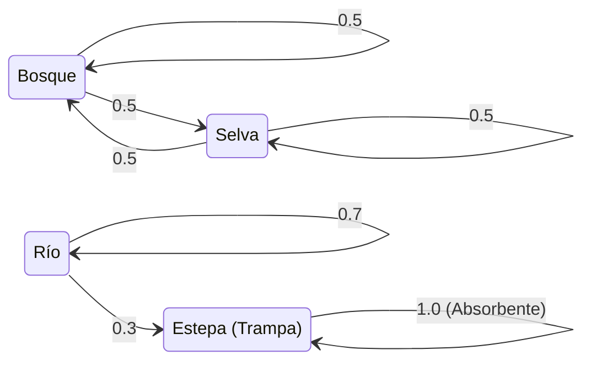

# Ejercicio 3: Cadenas de Markov y Matrices Estocásticas

> **Ejercicio 3.**
>
> **a) Sea P $\in \mathbb{R}^{n \times n}$ una matriz de Markov.**
>
> - **i)** Probar que si $P$ es diagonalizable y $-1$ no es autovalor, entonces existe el estado límite para todo estado inicial.
> - **ii)** Sean $\alpha, \beta, \gamma \in \mathbb{R}$ y $v_0 = \alpha w_1 + \beta w_2 + \gamma u$ donde $w_1$ y $w_2$ son estados de equilibrio de $P$ y $u$ es un autovector de $P$ con autovalor $\lambda$ tal que $|\lambda| < 1$. Calcular el estado límite de la sucesión $v_k = P^k v_0$ en función de $\alpha, \beta, \gamma, w_1, w_2$ y u.
>
> **b)** Cuatro hábitats: Bosque (B), Selva (S), Estepa (E) y Río (R) están habitados por un grupo de animales. El movimiento anual entre estos hábitats está gobernado por las siguientes reglas:
>
> - Entre el Bosque (B) y la Selva (S), cada año hay una probabilidad de 0.5 de permanecer en el mismo hábitat y 0.5 de moverse al otro.
> - Si un animal se encuentra en la Estepa (E), al año siguiente permanecerá allí.
> - En el Río (R), cada año un animal permanece en R con probabilidad 0.7, o se traslada a la Estepa (E) con probabilidad 0.3.
> 
> - **i)** Escribir la matriz de transición P correspondiente (orden de hábitats: B, S, E, R), calcular sus autovalores y el autoespacio de vectores de equilibrio y los asociados a $\lambda = 0$. ¿Qué dimensión tiene cada uno de estos autoespacios? ¿Es diagonalizable la matriz P? Justificar.
> - **ii)** Inicialmente, la población de animales es la siguiente: 300 en el Bosque, 100 en la Selva, 200 en la Estepa y 0 en el Río. Calcular cómo evolucionará la población a largo plazo.

## Interpretación del Enunciado

Estamos ante un examen de modelado demográfico de una Red Trófica que decanta en un sistema compartimentado: **Cadenas de Markov Absorbentes y Regulares**.
En la fase Teórica (**Inciso A**), nos exige ratificar analíticamente las reglas del comportamiento límite cuando las potencias matriciales tienden a infinito en presencia de combinaciones lineales autovectoriales. 
En la fase Práctica (**Inciso B**), construiremos la matriz estocástica $4 \times 4$. Los flujos muestran que el Bloque (B, S) forma una sub-cadena regular hermética aislada, mientras que el Bloque (E, R) contiene movimientos directos desde el Río a un hábitat trampa "absorbente" (Estepa=1.0).

---

## Solución del Ejercicio

### Inciso A: Estados de Equilibrio y Límites Asintóticos

#### Demostración A-1: Existencia de Estado Límite (Ausencia de Oscilación)

> **a-i)** Probar que si $P$ es diagonalizable y $-1$ no es autovalor, entonces existe el estado límite para todo estado inicial.

Por axiomas lógicos de la Teoría de Perron-Frobenius aplicada a Matrices Estocásticas (Markov), sabemos fehacientemente que el radio espectral de cualquier red probabilística carente de absorción neta está estrictamente acotado: **absolutamente todos sus autovalores están confinados dentro del disco unitario**, es decir, $|\lambda_i| \leq 1$.

Si la matriz $P$ goza de la propiedad de ser **diagonalizable**, le asiste el mérito de poseer una base rotunda e infalible conformada por sus $n$ autovectores lícitos independientes ($v_1, \dots, v_n$). Cualquier vector demográfico arbitrario arrojado inicial al sistema ($v_0$) podrá mapearse nativamente como un combinado aditivo de ellos:

$$
v_0 = c_1 v_1 + c_2 v_2 + \dots + c_n v_n
$$

A este inicio lo sometemos al suplicio iterativo de la Cadena de Markov, bombeando $k$ generaciones hacia el infinito $P^k v_0$:

$$
P^k v_0 = c_1 (\lambda_1)^k v_1 + c_2 (\lambda_2)^k v_2 + \dots + c_n (\lambda_n)^k v_n
$$

Dividimos las tribus de los autovalores presentes dentro del disco unitario en tres castas:

1. **La Casta de Colapso ($|\lambda_i| < 1$)**: Estos autovalores traccionan contracciones, y al ser elevados al límite infinito $\lim_{k\to\infty} \lambda_i^k = 0$. Todos esos términos se extinguen al originar el Estado Estacionario.
2. **La Casta Unívoca Fija ($\lambda_j = 1$)**: Los autovalores idénticos de equilibrio inmutable. $\lim_{k\to\infty} 1^k = 1$. Sus autovectores perviven como el lecho rocoso del estado asintótico límite (componente firme de equilibrio).
3. **La Casta Problemática Parietal ($\lambda_m = -1$)**: El gran mal de las Cadenas Oscilantes Periódicas (ej: semáforos o ping pong puro), donde $\lim_{k\to\infty} (-1)^k \to \{1, -1, 1, -1\}$. Acá el límite alternaría violentamente de por vida sin cuajar.

Pero, el enunciado exilia dictatorialmente la existencia de la Tercera Casta asegurando como verdad máxima de hipótesis que **"-1 NO es autovalor"**. 
Despojado de oscilaciones pares-impares, y con los menores colapsados, la asíntota iterativa sobre $v_0$ purga todos sus escombros reteniendo únicamente a los herederos inmutables de $\lambda=1$. Por ende, **el Estado Límite converge irrefutablemente y existe siempre para todo estado inicial $v_0$**. 

#### Demostración A-2: Mapeo Algebraico del Límite Mezclado

> **a-ii)** Sean $\alpha, \beta, \gamma \in \mathbb{R}$ y $v_0 = \alpha w_1 + \beta w_2 + \gamma u$ donde $w_1$ y $w_2$ son estados de equilibrio de $P$ y $u$ es un autovector con $|\lambda| < 1$. Calcular el límite de $v_k$.

Aplicamos el motor deductivo que acabamos de cincelar analíticamente. El enunciado obsequió las raíces genéticas de cada vector base:
- $w_1$ y $w_2$ ostentan ser "estados de equilibrio puros". En el folclore de Markov, un vector es equilibrio si la matriz lo transita impávido dejándolo calcado ($P w_i = 1 \cdot w_i$). Ergo, su autovalor tatuado es **$\lambda = 1$**.
- $u$ es un descastado sub-estacionario con autovalor flagelado **$|\lambda| < 1$**.

Desatamos el límite sucesivo aplicando el operador matriz multiplicativo lineal $P^k$ sobre todo el conjunto $v_0$:

$$
\lim_{k \to \infty} P^k v_0 = \lim_{k \to \infty} P^k (\alpha w_1 + \beta w_2 + \gamma u)
$$
$$
\lim_{k \to \infty} v_k = \lim_{k \to \infty} \Big[ \alpha (\lambda_{w1})^k w_1 + \beta (\lambda_{w2})^k w_2 + \gamma (\lambda_u)^k u \Big]
$$
$$
\lim_{k \to \infty} v_k = \alpha (1)^k \cdot w_1 \quad + \quad \beta (1)^k \cdot w_2 \quad + \quad \gamma (\lambda)^k \cdot u
$$

Ejercemos el peso inexorable del tiempo generacional infinito:
$$
\lim_{k \to \infty} v_k = \alpha \cdot w_1 \quad + \quad \beta \cdot w_2 \quad + \quad \gamma \cdot (0) \cdot u
$$
$$
\lim_{k \to \infty} v_k = \alpha w_1 + \beta w_2
$$

El estado límite decanta y reposa imperturbable como una combinación lineal pura de los estados estacionarios aportados inicialmente.

---

### Inciso B: Modelado de Dinámica Poblacional Markoviana

#### Construcción de Matriz y Autoespacios

> **b-i)** Escribir matriz transición P... calcular autovalores y autoespacios de equilibrio y de $\lambda=0$. ¿Dimensiones? ¿Diagonalizable?

La lectura del enunciado desglosa la siguiente arquitectura topográfica natural:


El orden matricial estricto pautado en columna (origen) es $B, S, E, R$. Vertiendo las probabilidades de transición en destino (filas):

$$
P = \begin{pmatrix} 
0.5 & 0.5 & 0 & 0 \\
0.5 & 0.5 & 0 & 0 \\
0 & 0 & 1 & 0.3 \\
0 & 0 & 0 & 0.7 
\end{pmatrix}
$$

El arreglo nos devuelve una **Matriz Triangular Inferior en Bloques**. Extraemos majestuosamente el espectro de autovalores evaluando las sub-diagonales de los bloques:
- **Bloque Izquierdo** (B-S) $\begin{pmatrix} 0.5 & 0.5 \\ 0.5 & 0.5 \end{pmatrix}$: Siendo hermético y simétrico bi-direccional posee autovalores $1$ y $0$.
- **Bloque Derecho** (E-R) $\begin{pmatrix} 1 & 0.3 \\ 0 & 0.7 \end{pmatrix}$: Triangular puro; sus autovalores moran grabados en su lomo diagonal: $1$ y $0.7$.

El **Espectro Radial** de la Matriz P es: $\lambda = \{1, 1, 0, 0.7\}$.

**Encontrando Vector de Equilibrio ($\lambda = 1$):**
Resolviendo el sub-sistema homogéneo castigado $(P - 1I)v = 0$:

$$
\begin{pmatrix} 
-0.5 & 0.5 & 0 & 0 \\
0.5 & -0.5 & 0 & 0 \\
0 & 0 & 0 & 0.3 \\
0 & 0 & 0 & -0.3 
\end{pmatrix}
\begin{pmatrix} b \\ s \\ e \\ r \end{pmatrix} = 
\begin{pmatrix} 0 \\ 0 \\ 0 \\ 0 \end{pmatrix}
$$
De las dos primeras deducimos infaliblemente que $\implies b = s$.
De las últimas extraemos fútilmente que $0.3r=0 \implies r = 0$.
La variable esteparia ($e$) campea libre.
Por lo tanto el núcleo originario despliega y escupe la base dual:
**Autoespacio $E_{\lambda=1} = \operatorname{gen}\{(1, 1, 0, 0)^T, (0, 0, 1, 0)^T\}$. Dimensión = 2.**

**Encontrando Vector del Núcleo Vital ($\lambda = 0$):**
Resolviendo $(P - 0I)v = 0 \implies Pv = 0$:
La variable $r = 0$, $e = 0$, mientras que $0.5b + 0.5s = 0 \implies s = -b$.
**Autoespacio $E_{\lambda=0} = \operatorname{gen}\{(1, -1, 0, 0)^T\}$. Dimensión = 1.**

**¿Posee la matriz el don de la Diagonalizabilidad?**
Posee cuatro asientos espectrales en su estirpe. Sus autovalores acusan multiplicidad algebraica $\lambda_1 (alg: 2)$, $\lambda_0 (alg: 1)$, $\lambda_{0.7} (alg: 1)$. 
Al hurgar en sus tripas geométricas confirmamos empíricamente que $\lambda_1$ proveyó $\dim = 2$ eslabones. Los demás dictan el mínimo existencial $\dim = 1$.
$\dim(E_1) + \dim(E_0) + \dim(E_{0.7}) = 2 + 1 + 1 = 4$.
Al gestar una base completa integral de $4$ columnas robustas autovectoriales lícitas, **concluimos fehacientemente que la matriz P SÍ ESTÁ ABALADA PARA SER DIAGONALIZABLE**.

---

#### Proyección Temporal Demográfica asintótica

> **b-ii)** Inicialmente, población: 300 Bosque, 100 Selva, 200 Estepa y 0 Río. Calcular evolución a largo plazo.

Frente el vector estacional genésico $v_0 = (300, 100, 200, 0)^T$, predeciremos su destino final dictado por $\lim_{k\to\infty} P^k v_0$.

En lugar de empedrar dolorosas combinaciones lineales formales basales, al haber destripado la anatomía de los bloques con antelación, el cálculo emerge intuitivo como luz solar:
1. El Sistema $A$ **(Bosque-Selva)** porta en sus adentros iniciales un monto masivo de individuos $300 + 100 = 400$. Dado que las probabilidades de permuta y anclaje estipuladas son perfectamente equiprobables ($0.5$ cada lado) y la frontera está amurallada sin escombros de salida ni entrada a otros hábitats, el límite infinito homogeneizará la biomasa distribuyéndola al $50\%$ clavado. $\implies \text{Bosque} = 200$, $\text{Selva} = 200$.

2. El Sistema $B$ **(Estepa-Río)** arranca infértil en la cúpula acuática fluvial ($\text{Río} = 0$). Como el Río es el único surtidor proyector capaz de escupir animales hacia la Estepa progresivamente por probabilidad cruzada; al carecer de caudal original ($0$ unidades traccionan $0$ pases), el río pervive vacío crónicamente. La Estepa absorbió de genésis a $200$ especímenes, y al ser Hábitat Trampa (Permanece $1.0$), retiene la sumatoria petrificada sin expirar exiliados. $\implies \text{Estepa} = 200$, $\text{Río} = 0$.

**Dictamen asintótico definitivo**: En el balance demográfico secular de largo plazo, el ensamble biológico de la región perimetral se cristalizará milimétricamente inmutable en el vector estacionario general $\mathbf{v_\infty = (200, 200, 200, 0)^T}$. 

---

## Verificación Empírica Computacional (NumPy)

Convocaremos la maquinaria computacional matricial `NumPy` como tribunal decisivo, instanciando la Cadena Estocástica $P$, diseccionando con escrúpulo matemático robótico sus propios autoespacios (contrastando nuestras afirmaciones topológicas) y forzando simulaciones exponencias $P^{100} v_0$ hacia la quietud eterna de la convergencia markoviana:

```python
--8<-- "Examen_2026_02_18/03_cadenas_markov/verificacion.py"
```
